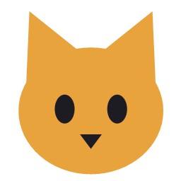

<p align="center">
  
</p>

# Meows

[](https://github.com/Zeralius/Meows/actions/workflows/ci.yml)

A desktop companion for the jobs that usually mean a terminal, a file manager and a lot of
clicking. Meows itself is just a shell: it finds plugins, lets you switch them on, and gives each
one a tab. Everything useful is a plugin, and you only turn on the ones you want.

Windows, built with Avalonia on .NET 10. The download is self contained, so there is no runtime
to install.

## What comes with it

| Plugin | What it does |
|---|---|
| **[Chonk](Meows.Plugins.Chonk/README.md)** | Measures where the room on a drive went, biggest first, says what each folder actually is, notices an archive sitting beside its own extracted contents, and clears out what you no longer want |
| **[Purrge](Meows.Plugins.Purrge/README.md)** | Finds files with identical content anywhere on the machine, groups them, and removes the copies you do not want; also checks that a backup copy is really complete and identical, without touching either side |
| **[Molt](Meows.Plugins.Molt/README.md)** | Sheds caches and build output that can be rebuilt, and tells you what losing each one costs first |
| **[Mouser](Meows.Plugins.Mouser/README.md)** | Hunts down dead weight: empty folders, empty files, shortcuts pointing at things that are gone |
| **[Litter](Meows.Plugins.Litter/README.md)** | Sorts out the downloads folder by age and kind, and calls out the downloads that never finished |
| **[Saucer](Meows.Plugins.Saucer/README.md)** | Keeps what you copy, images included, and drops images into a folder for sorting |
| **[Birdwatch](Meows.Plugins.Birdwatch/README.md)** | Watches accounts on Bluesky, Mastodon and Reddit, and any RSS feed with pictures in it, and saves what they post into that same folder, with no login anywhere |
| **[Tin](Meows.Plugins.Tin/README.md)** | Reads the exports and statements your bank hands out, CSV or PDF, and says what is recurring, what quietly went up, and what is still going out for something you stopped using |
| **[Collar](Meows.Plugins.Collar/README.md)** | Keeps the dates that matter and the paper behind them, and says so on the notification surface when one comes round |
| **[Scruff](Meows.Plugins.Scruff/README.md)** | Takes the metadata out of pictures, posts them to Bluesky, Mastodon, Discord, DeviantArt and Tumblr, and hands them to FurAffinity, X, Instagram and Reddit with every field spelled that site's way |
| **[Purr](Meows.Plugins.Purr/README.md)** | Says what Meows is watching, when it last looked, and which watch quietly stopped |
| **[Kit](Meows.Plugins.Kit/README.md)** | Turns a folder of maps, tokens and handouts into a one-shot the table can use: named, gridded or gridless, fitted, framed, and handed to Foundry or Roll20 the way each wants it |
| **[Weigh-In](Meows.Plugins.WeighIn/README.md)** | Measures every drive once a day and says what grew: which drive lost how much since last week, and the folders responsible |
| **[Kibble](Meows.Plugins.Kibble/README.md)** | Sorts a folder of new material into queues, one key press at a time, and can bundle a pick into a comic |
| **[Perch](Meows.Plugins.Perch/README.md)** | One timeline of what the posting bot will send and when, every group merged, out as far as the queues last |
| **[Portion](Meows.Plugins.Portion/README.md)** | Finds what the bot will fail on in every queue before it fails at night, and shrinks the pictures that can be shrunk |
| **[Telegram Poster](Meows.Plugins.TelegramPoster/README.md)** | Drives a [Telegram posting bot](https://github.com/Zeralius/telegram-posting-bot): its groups, queues and schedule, including slowing a group down so a short queue lasts |

The last four are built around a specific posting bot. The rest are general purpose.

## Getting it

Download `Meows-<version>-win-x64.zip` from the
[releases page](https://github.com/Zeralius/Meows/releases), unzip it anywhere, and run
`Meows.exe`. Nothing else is needed.

**Extract the zip properly before running it.** Launching `Meows.exe` from inside the archive
makes your unzip tool copy it to a temporary folder on its own, and some of the plugins lose
files they need. Meows will start, but those plugins refuse to open and say so on their card.

Every plugin starts switched off. Open the **Plugins** tab, turn on the ones you want, and each
gets its own tab. Turning one off closes its tab again. Nothing runs until you ask for it.

The cards sit under headings a plugin picks for itself, so the disk tools are together and the two
built around the posting bot are together. **Open plugins folder** on that tab takes you to where
they are read from.

The **Settings** tab has two choices, and both take effect as you make them:

- **Theme**: light, dark, or follow the system. Following the system means Meows changes with
  Windows, including when Windows switches itself at sunset.
- **Language**: English, German, or follow the system. It applies to the shell and to every plugin
  that ships the language. Anything a plugin has not translated stays in English rather than
  disappearing.
- **In the background**: Meows sits in the notification area, and closing the window hides it
  rather than quitting. Everything that watches or waits, Collar's dates, Birdwatch's refresh, a
  scan you started, carries on while the window is hidden, and the icon shows a dot when there is
  something to read and a ring while something is still working. *Quit* is in the icon's menu. Untick the setting and the close button quits,
  as it did before 2.0.
- **Starting up**: whether Meows starts when you log in, and whether it starts in the tray or
  with the window open. It writes one entry to the per-user startup list, which needs no admin
  rights and shows up in the Task Manager's Startup tab like anything else.

**Ctrl+K** opens the command palette: type a plugin under either of its names, a setting, a
word from the history, or anything an open plugin is showing, a file in Kibble's grid, a folder
Chonk measured, a date in Collar, a payee in Tin, and Enter lands on it. Every plugin is named after the cat; each also says what
it is in plain words, and the paw in the bottom bar, or the Settings tab, picks which name is on
the tabs and cards: Purrge or Duplicates, Chonk or Disk usage, Kibble or Sorting.

The **History** tab is what the plugins did, all of them in one list: what Kibble queued where,
what Purrge recycled, what Scruff posted, what Portion shrank, which date Collar dealt with. It
is kept in a small database beside the settings and survives the window closing, the plugin
being switched off, and the undo list being emptied. A line the plugin that wrote it can still
reverse, a Kibble send whose file is still in the queue, carries a **Put back** button while that
plugin is open; the shell asks the plugin first, so the button is only there when pressing it
would do something. The tab's bottom bar says how big the database file is and how many lines it
holds, with **Forget…** older than a month, three months, six months, a year or everything, for
every plugin or only the one being shown, which asks first and says how many lines would go, and
**Compact**, which gives the room back. The Settings tab has the standing rule, **keep everything**
by default, or a year, six months, three months or a month, applied when Meows starts and once a
day while it runs; Purr lists that pass under Meows. Neither forgetting ever touches the facts a
plugin keeps or the hashes anything has seen.

Every card on the **Plugins** tab carries a line of health: the last thing that plugin recorded
and how long ago, and how many of its watches are running, a stopped one in red.

The **Log** tab is what Meows and the plugins said this run, with a word to filter on, a source
to narrow to, *Only trouble* to see the warnings and errors, and on the right a level per source:
everything, warnings and errors, or nothing, which is quiet mode for a plugin with a lot to say.
The bottom pane shows the same lines under the same levels; `meows.log` keeps every line
regardless.

The Settings tab's **Moving house** section exports all of that as one zip and imports it again on
another machine: preferences, which plugins are on, the bot folder, the history, every plugin's
settings and data, never the secrets and never the log. An import keeps what it writes over as a
bundle of its own beside the settings, so it can be undone by importing that.

Settings, logs and that history live in `%APPDATA%\Meows`, never inside the folder you unzipped,
so deleting that folder resets Meows completely. `meows.log` there is also where a crash gets written, stack
trace and all, which is worth attaching to a bug report. The log stays in English whatever the
window is set to, because it is the thing that gets pasted into a bug report.

To check an install without opening the window:

```bash
Meows.exe --list-plugins
```

It lists what the shell can find, flags anything refused on contract grounds or missing a private
library, and exits non zero if either happened. This is what the release build runs against the
package it just made.

## Building it yourself

```bash
git clone https://github.com/Zeralius/Meows.git
cd Meows
dotnet run --project Meows/Meows.csproj
```

You need the .NET 10 SDK. In Rider or Visual Studio, set **Meows** as the startup project and make
the run configuration build the **whole solution**: the shell does not reference the plugin
projects, so building only the startup project leaves you debugging yesterday's plugin DLLs.
[PLUGIN-GUIDE.md](PLUGIN-GUIDE.md#in-rider) covers that, along with some Rider XAML warnings that
are false positives.

```bash
dotnet test
```

The suite covers the filesystem and logic layers: duplicate scanning, disk measuring, queue
maths, file intake and its refusals, comic page ordering, clipboard conversion, cache
cataloguing, shortcut parsing, metadata stripping and post composition, and the plugin contract
rules. Every plugin's view is also built for real, headless, in both themes and both languages,
and anything Avalonia complains about fails the test, so a binding to a property that is not
there or a template that does not resolve is caught before it is a blank spot on screen.

## Writing a plugin

A plugin is a class library that references `Meows.Plugins.Abstractions` and exports one type:

```csharp
public sealed class MyPlugin : IMeowsPlugin
{
    public string Id => "meows.my-plugin";
    public string DisplayName => "My Plugin";
    public string Description => "What it does.";
    public string? Icon => "🎲";

    public Control CreateView(IMeowsHost host) =>
        new MyView { DataContext = new MyViewModel(host) };
}
```

`IMeowsHost` gives you a private data directory, JSON settings, the shared log, the notification
surface, background work the shell cancels for you, and the language the window is in.

Colours come from the shell too. Ask for `{DynamicResource MeowsCard}` rather than writing a hex
value and your plugin follows the theme; ship a `Strings.<code>.json` per language and it follows
the language. Both are looked up by name at run time, so neither needs a reference to the shell,
and a plugin that does neither still works.

There is a template that writes all of that for you:

```bash
dotnet new install Meows.Plugins.Template
dotnet new meows-plugin -n WeatherWatch
```

Drop the built DLL into a folder under `plugins/` and Meows picks it up. You do not need to fork
this repository, or even clone it: reference the
[`Meows.Plugins.Abstractions`](https://www.nuget.org/packages/Meows.Plugins.Abstractions) package,
and set `MEOWS_PLUGINS_DIR` to your own folder to load your plugin alongside the built in ones.

For a plugin that lives in this repository and ships with the release, **Kitten** writes it
instead: `dotnet run --project Meows.Kitten -- Whiskers --plain "Print queue"` makes the project,
adds it to the solution, the test project, the shipped list and the table above, then builds it
and runs the tests that know every plugin. See [Meows.Kitten/README.md](Meows.Kitten/README.md).

**[PLUGIN-GUIDE.md](PLUGIN-GUIDE.md)** is the full contract: project setup, every member of
`IMeowsHost`, notifications, background work, threading, lifetime, packaging and the assembly
isolation rules.

## How plugins are found

Each plugin lives in its own subfolder of a `plugins` directory. Meows looks for one:

1. in `MEOWS_PLUGINS_DIR`, if set, which takes a `;` separated list and adds to the search rather
   than replacing it
2. next to `Meows.exe`, which is the layout in the release zip
3. in any parent directory, which is what makes a source build find the repository's own folder

Inside a plugin folder, Meows prefers `<foldername>.dll` and otherwise scans every `.dll` there.
Duplicate plugin ids are ignored, and a plugin that throws while starting up is caught, marked
**Failed** on its card and logged, so a broken plugin cannot take the app down with it.

## Repository layout

| | |
|---|---|
| `Meows/` | The shell: window, tab host, plugin loader. [README](Meows/README.md) |
| `Meows.Plugins.Abstractions/` | The contract a plugin implements, published as a NuGet package |
| `Meows.Plugins.*/` | The plugins listed above |
| `Meows.Bot.Core/` | Shared: the posting bot's config and media rules |
| `Meows.Disk/` | Shared: Recycle Bin deletion, folder walking, the drive scan, content hashing and what a folder is |
| `Meows.Media/` | Shared: metadata stripping and fitting a picture to a limit, on the shell's Skia |
| `template/` | The `dotnet new` template, published as `Meows.Plugins.Template` |
| `Meows.Kitten/` | Developer tool: writes a new in-tree plugin from a name and proves it builds. [README](Meows.Kitten/README.md) |
| `Meows.Tests/` | The test suite |

## Versioning

`major.minor.patch`, where **major** is a change to how the app works or looks, **minor** is a
new plugin or a substantial new capability inside one, and **patch** is a smaller feature or a
bug fix.

The app version is in `Meows/Meows.csproj` and shows at the bottom left of the window, so you can
always tell which build you are running.

`Meows.Plugins.Abstractions` carries its own version and does **not** move with the app, so adding
a plugin does not make every external plugin look out of date. Its version changes only when the
contract itself does: **major** if a member is removed or changed, **minor** if one is added,
**patch** for documentation.

Meows checks that version when it loads a plugin and refuses anything it cannot honour, with the
reason on the plugin's card rather than a crash later:

> Built for Meows contract 0.3.0, which is newer than this shell's 0.2.1. Update Meows, or rebuild
> the plugin against 0.2.1.

A newer contract is refused; an older one is fine, since additions stay backward compatible.

The same check covers **Avalonia**, for the same reason. The shell and every plugin share one copy
of it, because a plugin hands back a `Control` and two copies mean two unrelated types with that
name. A plugin built against a different major, or a newer version than the shell carries, is
refused with the reason on its card rather than failing somewhere far from the cause.

## CI and releases

Both workflows run on `windows-latest`, which is required rather than preferred: the app is a
WinExe and several plugins delete through the Windows shell.

**[ci.yml](.github/workflows/ci.yml)** runs on every push to `main` and every pull request. It
builds in Release, runs the tests, and checks that the plugin contract still packs.

**[release.yml](.github/workflows/release.yml)** runs when a `v*` tag is pushed, or manually with
a version typed in. It runs the tests first, publishes the shell self contained for win-x64,
stages every plugin into `plugins/`, drops the third party native symbols, checks the package,
then zips it and attaches it to a GitHub release along with the contract `.nupkg`.

Staging the plugins is a separate step because the shell does not reference the plugin projects,
which is what keeps them drop in. A plain `dotnet publish` would produce an app with no plugins at
all. Which plugins to build and stage is worked out from the folders on disk rather than from a
list in the workflow, so adding one needs no edit here.

It also publishes `Meows.Plugins.Abstractions` and `Meows.Plugins.Template` to NuGet, using
[Trusted Publishing](https://learn.microsoft.com/en-us/nuget/nuget-org/trusted-publishing) rather
than a stored key: the job proves who it is with a token GitHub signs, and nuget.org returns a key
valid for one hour, so there is no long lived secret to leak. The policy on nuget.org names this
repository and `release.yml` by name, so renaming that file stops publishing until the policy is
updated to match. A fork with no `NUGET_USER` secret skips those steps and still gets a release.

The check before all that runs `Meows.exe --list-plugins` against the package and fails the build if
anything was refused or is missing a private library. Asking the app is not the same as checking
file names: a plugin whose shared library did not get staged loads perfectly and then fails the
moment it is switched on, which is exactly how three plugins once shipped broken.

To cut a release:

```bash
git tag v0.7.0 && git push origin v0.7.0
```

## Licence

MIT. See [LICENSE](LICENSE). Use it, fork it, build plugins on it and sell them if you like.
